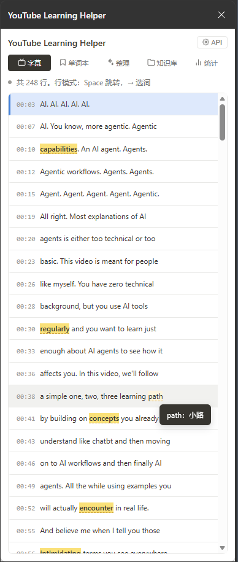
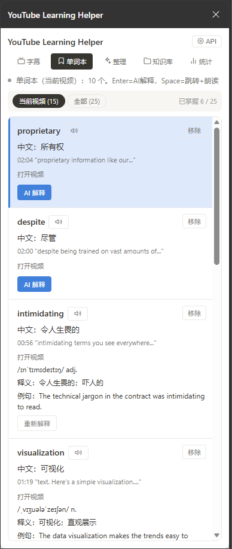
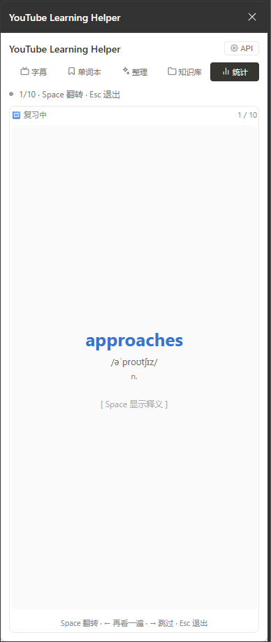
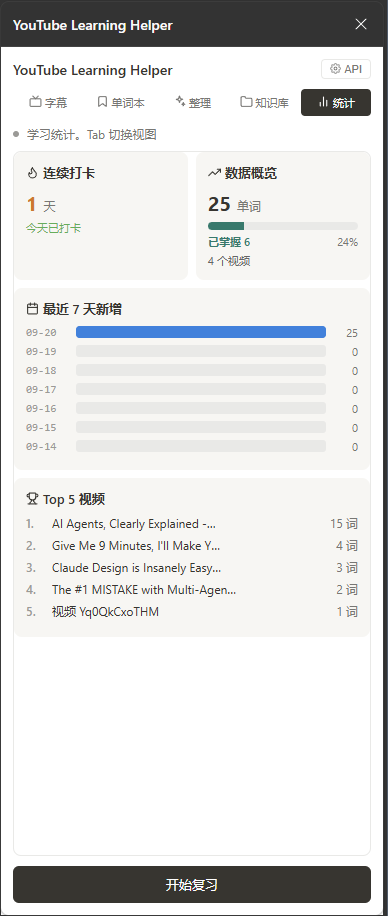

# YouTube Learning Helper

一个自用的 YouTube 英语学习 Chrome 扩展。看视频的同时记单词、练发音、用 AI 整理知识、建个人知识库。

配合 **EasyInput AI 键盘**（8 键 + 1 旋钮），可以做到无鼠标操作。

---

## 📸 预览

<p align="center">
  
  
  
  
</p>

<p align="center">
  <sub>字幕 · 单词本 · 复习模式 · 统计视图</sub>
</p>

---

## 💡 设计理念

**已掌握的词默认折叠，让你专注在不会的词上。**

这个插件不是把所有词堆在你面前，而是帮你做减法：

- 标记的单词自己说了算，AI 只负责补充信息
- 已掌握的自动收进折叠区，键盘默认跳过
- AI 结果只生成一次，之后秒读缓存，不重复扣费

---
## ✨ 功能

### 📺 字幕

- 自动抓取当前视频的英文字幕（含 PoToken 拦截）
- 每条字幕显示时间戳，点击跳转到视频对应位置并暂停
- 鼠标悬停或键盘选词显示中文释义（Google 翻译）
- 点击单词标记为生词（黄色高亮）

### 📖 单词本

- 全局单词本，跨视频保存
- 顶部筛选栏：当前视频 / 全部
- **已掌握分组**：未掌握在上，已掌握折叠在下，键盘默认跳过
- 每张单词卡显示：单词、中文、原句（可点击跳转）、所属视频链接
- 🔊 一键朗读单词（浏览器 TTS）
- 🤖 按需 AI 解释：音标、词性、语境释义、例句
- 按 Space 跳回原句 + 朗读
- 跨视频时只朗读、不跳转
- 鼠标悬停时显示"✓ 已掌握"，点击一键标记

### 🔁 复习模式

- 从统计视图进入，每次 10 张卡片
- 按"最久没复习"排序
- 卡片正面：单词 + 音标 + 词性；按 Space 翻转显示释义、例句、原文
- 翻转时自动朗读单词
- 三个选项：Enter 已掌握 / ← 再看一遍 / → 跳过
- 完成页显示统计 + 连续打卡数

### 🤖 AI 整理

- 一键把整篇字幕发给 DeepSeek，生成摘要 + 核心知识点
- 结果缓存到本地，切走再回来秒显示（不重复扣费）
- 来源徽章：缓存 / API 调用

### 📚 知识库

- 按视频保存摘要、知识点、单词集、完整字幕
- 自定义标签，支持按标签筛选
- 卡片可折叠/展开
- 同一视频重复保存直接覆盖，保留原标签
- 点击单词跳到单词本对应卡片

### 📊 统计视图

- 连续打卡天数（今天标记过单词 / 用过 AI / 复习过即算打卡）
- 数据概览 + 已掌握占比进度条
- 最近 7 天新增柱状图
- Top 5 视频（按单词数）

### 📤 导出

- 一键复制 Markdown 到剪贴板
- 三种范围：导出当前 / 导出标签 / 导出全部
- 可直接粘贴到飞书、Notion、Obsidian
- 可选是否包含完整字幕

### 🎨 界面

- Notion 风格设计：统一颜色、圆角、间距、图标
- 状态栏彩色圆点：成功绿 / 警告橙 / 错误红 / 加载中蓝（脉冲）/ 普通灰
- 侧边栏布局自适应，可拉伸宽度

---

## ⌨️ 键盘映射（EasyInput）

### 通用操作

| 硬件 | 发送按键 | 插件行为 |
| :--- | :--- | :--- |
| KEY1 | 语音输入 | （保留） |
| KEY2 | 语音编辑 | （保留） |
| KEY3 | Enter | 确认 / 跳转 / AI 解释 |
| KEY4 | Tab | 切换视图 |
| KEY5 | Esc | 返回 / 收起 |
| KEY6 | Space | 标记生词 / 跳转 + 朗读 |
| KEY7 | P | 播放 / 暂停视频 |
| KEY8 | S | 保存到知识库 |
| 旋钮旋转 | ↑ ↓ | 上下移动 / 滚动 |
| 旋钮短按 | 切换方向 | 上下 ↔ 左右 |
| 左右模式 | ← → | 单词本：切换筛选 |

### 复习模式

| 按键 | 行为 |
| :--- | :--- |
| Space | 翻转卡片 |
| Enter | 已掌握 → 下一张 |
| ← | 再看一遍（塞回队尾） |
| → | 跳过 |
| Esc | 退出复习 |

---

## 🛠️ 安装（开发者模式）

1. 下载或克隆本仓库：`git clone https://github.com/sil1021yan-ai/youtube-learning-helper.git`
2. 打开 Chrome，地址栏输入 `chrome://extensions/`
3. 打开右上角「开发者模式」
4. 点击「加载已解压的扩展程序」
5. 选择本仓库所在的文件夹
6. 打开 YouTube 视频页 → 点扩展图标 → 侧边栏打开

---

## 🚀 首次使用

1. 打开扩展侧边栏 → 点右上角 ⚙️ API
2. 填入 DeepSeek API Key（申请地址：https://platform.deepseek.com/）
3. 打开任意 YouTube 视频，字幕自动加载

> ⚠️ API Key 保存在浏览器本地（chrome.storage.local），不会上传到任何服务器。

---

## 🧱 技术栈

- Chrome Extension Manifest V3
- 无构建工具，纯原生 JS / HTML / CSS
- 数据存储：chrome.storage.local
- AI：DeepSeek API（OpenAI 兼容格式）
- 翻译：Google Translate 免费接口
- 发音：浏览器原生 speechSynthesis

---

## 📁 文件结构

```n
youtube-learning-extension/
├── manifest.json
├── background.js
├── content.js
├── page_script.js
├── popup.html
└── popup.js
```

---

## ⚠️ 已知限制

- 视频必须有 CC 字幕（英文优先）
- DeepSeek API Key 由用户自己填写，扩展不内置
- 仅支持 Chrome / Edge（Chromium 内核）

---

## 📌 更新日志

### v1.3（2026-09-21）
- 「生词」重命名为「单词本」
- 已掌握分组默认折叠，键盘默认跳过
- 知识库卡片「生词」改为「单词集」
- 复习模式：Space 翻转时自动朗读

### v1.2（2026-09-20）
- Notion 风格 UI 重构：颜色、间距、圆角统一
- Emoji 全面替换为 SVG 图标
- 状态栏彩色圆点（成功 / 警告 / 错误 / 加载中 / 普通）
- 侧边栏自适应布局

### v1.1（2026-09-20）
- 复习模式：闪卡翻转、已掌握、再看一遍、跳过
- 统计视图：打卡、进度条、7 天图表、Top 5
- 打卡系统：标记单词 / AI 整理 / 复习都算打卡
- 已掌握标记 + 进度条

### v1.0（2026-09-20）
- 首次发布
- 字幕抓取、单词本、AI 整理、知识库、导出、键盘适配

---

## 📄 License

个人使用，未指定开源协议。
